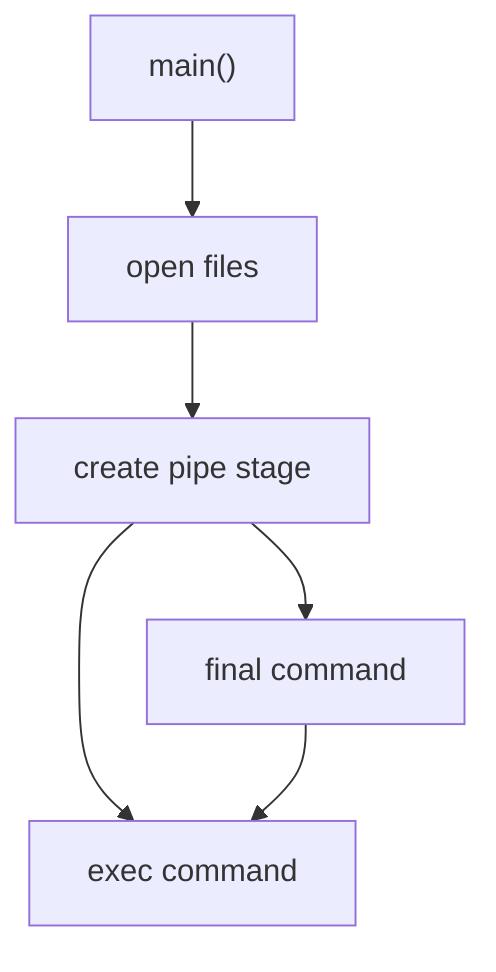
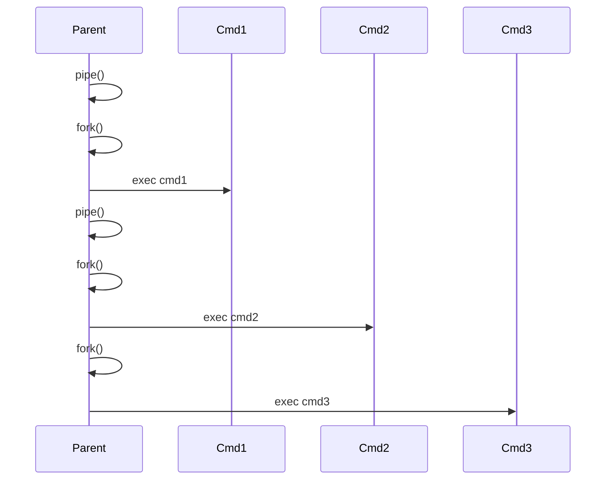

# Pipex

> A minimal C implementation of the Unix shell pipeline mechanism, demonstrating process orchestration, inter-process communication, and file descriptor management using the POSIX API.


## Table of Contents

* [Overview](#overview)
* [Problem](#problem)
* [Architecture](#architecture)
* [Pipeline Execution Model](#pipeline-execution-model)
* [File Descriptor Lifecycle](#file-descriptor-lifecycle)
* [Command Resolution](#command-resolution)
* [Error Handling](#error-handling)
* [Project Structure](#project-structure)
* [Build & Usage](#build--usage)
* [Engineering Notes](#engineering-notes)
* [License](#license)

---

# Overview

Pipex is a C implementation of the Unix shell **pipeline mechanism**.

It replicates the behaviour of:

```sh
< infile cmd1 | cmd2 | ... | cmdN > outfile
```

without invoking a shell interpreter.

Instead, the program manually constructs the pipeline using the Unix process and I/O APIs:

* `fork`
* `pipe`
* `dup2`
* `execve`
* `open / close`

Each command runs inside its own process, and adjacent commands communicate through anonymous pipes.

The project demonstrates how shell pipelines are implemented at the **operating system level**, focusing on correct process orchestration and file descriptor management.

---

# Problem

Given the command:

```sh
< infile cmd1 | cmd2 | cmd3 > outfile
```

the shell internally builds a pipeline equivalent to:

```
cmd1 → cmd2 → cmd3
```

Pipex reproduces this behaviour by:

1. opening input and output files
2. creating pipes between commands
3. spawning child processes
4. redirecting stdin/stdout using `dup2`
5. executing binaries with `execve`

The main challenge is ensuring that **file descriptors are duplicated and closed in the correct order** so that data flows properly through the pipeline.

---

# Architecture

Pipex follows a simple orchestration pipeline.

```
program start
      │
      ▼
argument validation
      │
      ▼
open infile / outfile
      │
      ▼
build pipeline
      │
      ▼
execute commands
```

The **parent process orchestrates the pipeline**, while each command runs in a child process created via `fork`.

---

### High-Level Pipeline

```
infile
  │
  ▼
cmd1 ──pipe──► cmd2 ──pipe──► cmd3
                              │
                              ▼
                           outfile
```

Each stage reads from its **stdin** and writes to **stdout**, which are redirected to pipes or files.

---

### Component Flow



---

# Pipeline Execution Model

The pipeline is constructed incrementally.

Pseudo execution:

```
open infile
open outfile

dup2(infile → stdin)

for each command except last
    create pipe
    fork

        child
            stdout → pipe write
            exec command

        parent
            stdin → pipe read

fork last command
    stdout → outfile
    exec command
```

The parent process progressively rewires its own `stdin` after each stage.
This turns the parent into the **pipeline backbone**, allowing the next command to attach to the previous stage without storing all pipe descriptors.

---

### Process Creation Timeline



---

# File Descriptor Lifecycle

Correct file descriptor management is essential.

Each pipe contains two endpoints:

```
pipe[0] → read end
pipe[1] → write end
```

When a child redirects output:

```
dup2(pipe[1], STDOUT_FILENO)
```

the original descriptor must then be closed.

Unused descriptors must always be closed in both parent and child processes.
Otherwise the pipeline may never receive **EOF**, causing processes to block indefinitely.

---

### FD Flow Per Stage

```
Before fork

stdin  → previous stage
stdout → terminal


After fork

child
stdout → pipe write

parent
stdin → pipe read
```

This pattern repeats for every stage of the pipeline.

---

# Command Resolution

`execve` requires an absolute binary path.

Pipex replicates shell behaviour by resolving commands using the `PATH` environment variable.

Example:

```
PATH=/usr/bin:/bin:/usr/local/bin
command: grep
```

Lookup attempts:

```
/usr/bin/grep
/bin/grep
/usr/local/bin/grep
```

The first executable path found via `access(X_OK)` is used.

---

# Error Handling

System calls are checked for failure and mapped to explicit exit codes.

| Code  | Meaning                |
| ----- | ---------------------- |
| `2`   | invalid arguments      |
| `3`   | pipe creation failed   |
| `4`   | fork failed            |
| `5`   | dup2 failed            |
| `126` | command not executable |
| `127` | command not found      |

Codes **126 and 127** follow POSIX shell conventions.

---

# Project Structure

```
pipex/
│
├── include/
│   └── pipex.h
│
├── srcs/
│   ├── pipex.c
│   └── pipex_utils.c
│
├── libft/
│   ├── ft_split.c
│   ├── ft_strjoin.c
│   ├── ft_strlen.c
│   ├── ft_strchr.c
│   └── ft_strncmp.c
│
└── Makefile
```

Responsibilities:

* **pipex.c** — pipeline orchestration and process creation
* **pipex_utils.c** — command parsing and PATH resolution
* **libft/** — minimal string utilities used for parsing

---

# Build & Usage

### Build

```
git clone https://github.com/artclave/pipex-42.git
cd pipex-42
make
```

### Program Syntax

```
./pipex <infile> <cmd1> [cmd2 ... cmdN] <outfile>
```

Example:

```
./pipex infile.txt "grep error" "wc -l" result.txt
```

Equivalent shell command:

```
< infile.txt grep error | wc -l > result.txt
```

---

# Engineering Notes

**The parent process acts as the pipeline backbone**

Instead of storing an array of pipe descriptors, the parent rewires its own stdin between stages.
This significantly simplifies descriptor management.

---

**`execve` replaces the process image**

When `execve` succeeds, the calling process becomes the target program.
No C code runs afterward, so descriptor cleanup must occur **before the exec call**.

---

**Descriptor hygiene is critical**

If a pipe write-end remains open in any process, the reader will never receive EOF.
This results in pipelines that appear to “hang”.

---

## License

This project was completed as part of the 42 School curriculum. It is intended for educational and portfolio purposes.

[Back to top](#pipex)